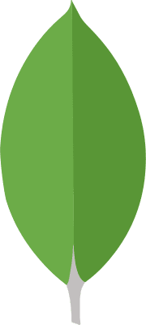

# Din Shub, Full Stack Developer
 
## 💪Current Stack:
- Angular
- Node.js
- Nest.js
- MongoDB
 
## 👨‍💻About Me:
Bs.c in Computer Science and Mathematics in Haifa University. A full stack developer with experience in Angular 2+, Node.js, Express, Nest.js, MongoDB.\
Avid gamer (mainly strategy and shooters/beat 'em up), Formula 1 fan (go McLaren!☝️) and enjoys watching anime (Demon Slayer and Hunter x Hunter👌)\
Currently working as fulltime full stack developer and using the stack as mentioned above.
 
## 💻Programming Experience:

 

 

## 😁Projects:
### BroBot:
My first real project from scratch. Written in python and using the Discord api. It is a discord bot that I made for my personal server, used for finding groups in Valorant (Team based shooting game).\
I planned to use the Valorant api for getting stats and using them in the chat for awesome features, but I didn't get an api key and eventually stopped playing and the server died😥.\
It's features currently are time tracking for users in voice chat (had a whole point system planned), playing Connect 4 against BroBot, Rock Paper Scissors against BroBot and team finding system based on auto role giving.

### Chess (java):
I love chess and always wanted to do a chess engine. Started doing it on Java, since it was the language I used the most and got relativly far into it until I leared about Bit Boards. Planning on restarting it using the Bit Board method.

### Task Force Arma 3 Radio (forked):
Added few features into the mods.

 

## 📞 Contact Me:

